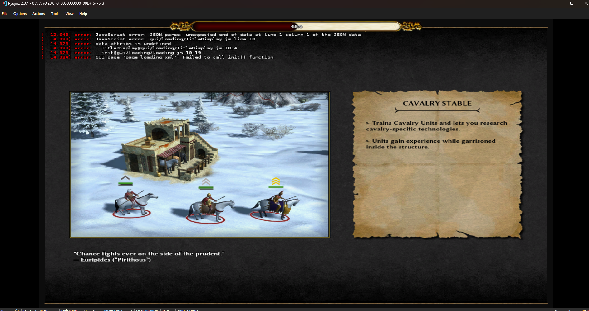
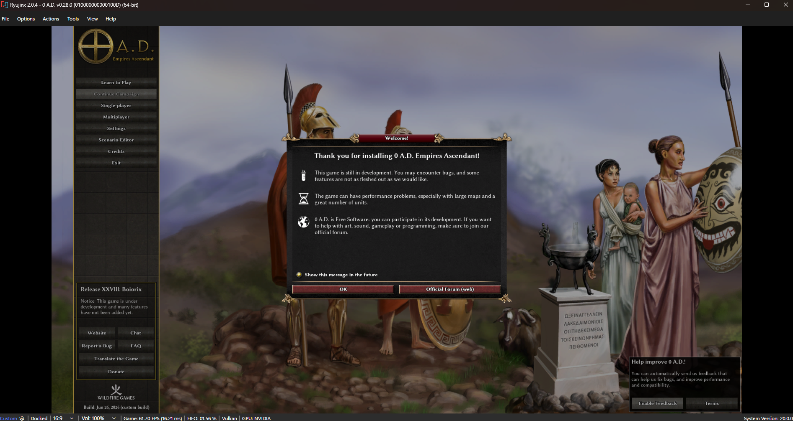

# How I ported 0 AD to Switch

So... Remember how I ported JS to Switch? Well I chose SpiderMonkey over V8 or QuickJS for one reason: To port 0AD to Switch.

0 AD is a really good RTS and I personally enjoy playing it quite a lot. I also really like portable gaming, specifically on the Switch. You can run 0 AD via L4S but it's far from the plug-and-play experience that I would desire. Porting it seemed ideal, so that's what I did.

You can read the post about SpiderMonkey-NX but the bottom line is that I got it working with Interpreter only. For a test of the engine I ported sandboxels (the browser physics voxel sandbox game thing, it's up on my GitHub if you want to play it!).

After porting it I realized that the spidermonkey port ran like trash. Like to the point where I couldn't fill the screen with sand without it lagging (with 2601MHz CPU!). So I decided to get JIT working. 

JIT was honestly not as bad as I had put it out to be. The main block was Horizon not allowing the code address to be w-x which SpiderMonkey expected. So I did a bit of a hack. Instead of rewriting a large portion of SpiderMonkey to play nice with HOS I just remapped the memory to what HOS expected for the specific scenarios (write via rw- and execute via r-x). This made it work fine!
(note: Ion and GC is still broken with JIT enabled and I haven't figured out why yet. Ion actually seems to reduce performance for me so it's fine in the end :P)

After JIT I had to crosscompile a bunch of libs. This wasn't that intresting, as there were barely any code changes.

Compiling pyrogenesis was a different story. msys2 kept acting up so I had to use WSL (msys2 better). After that it was a matter of adjusting paths and fixing how mods were loaded so they wouldn't break.

There were also some other things like adjusting stack sizes to avoid overflow and modifying the OpenGL backend to play nice with switch-mesa (mainly shader).

After all that, I got this glorious sight:

(of course this is't great, the game is streched and it crashes after this, but this is the first image I had after all this!)

Continuing on, I fixed some bugs with replays (the title screen is actually a map in disguise!). Then the main menu just booted (with audio working first try as a bonus!).

Input was next. I just set it up so the touchscreen acted as a mouse (it's good enough). Trying to load into a game would crash however. Turns out under heavy load JIT would freak out and generate junk, patching that was simple.

I also started testing on my OLED. Due to a bad linkerscript it wouldn't load on real HW (ryujinx didn't check this because I turned it off... whoops!).

When attemping to go ingame though there was another crash. Ion was writing to garbage so that had to be patched out (I ended up removing Ion in the end anyway).

The aspect ratio bug was next. SDL was just streching out the 4:3 default surface so that was simple. 

After that there was getting the cursor to work and other stuff and it's playable.

I also wanted to get the lobby/LAN working. I compiled gloox (which was rather simple), and wrote a TLS backend (a lot easier than trying to compile mbedTLS). Then it just worked.

The only thing to tackle is the poor performance, but that's for another time. It's caused by OpenGL draw call overhead and the only real way to fix it is a deko3d backend. Still a WIP.

---

← [Back to posts](./)
